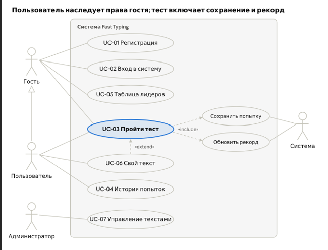
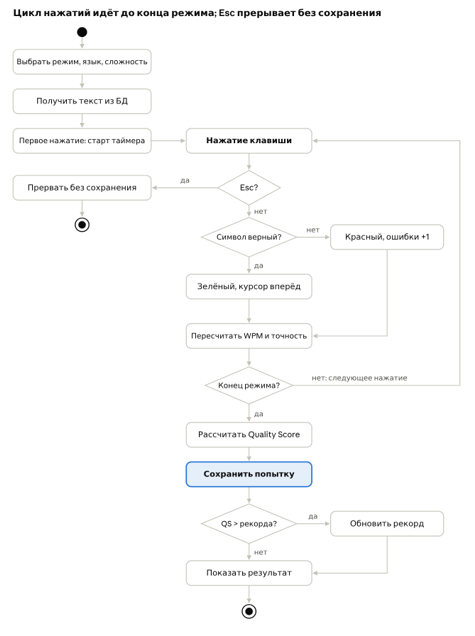
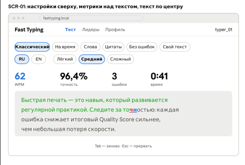
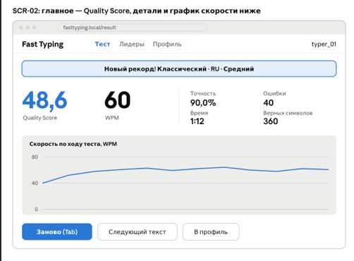
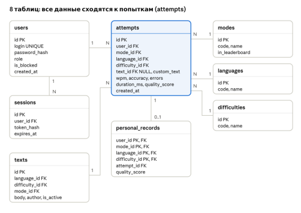

# Fast Typing

Веб-тренажёр скорости и точности печати. Пользователь проходит тест, видит скорость (WPM), точность и итоговую оценку Quality Score, а система сохраняет историю попыток и личные рекорды.

## Возможности

- Регистрация и вход по логину и паролю
- 6 режимов теста, 2 языка (RU, EN), 3 уровня сложности
- Подсчёт WPM, точности и ошибок в реальном времени
- Подсветка символов: верные — зелёным, ошибки — красным
- История попыток и личные рекорды
- Таблица лидеров (топ-50)
- Тест по своему тексту
- Управление текстами для администратора

## Режимы

| Режим | Когда заканчивается тест |
| Классический | Введён весь текст |
| На время | Прошло 30, 60 или 120 секунд |
| Слова | Введено 10, 25 или 50 слов |
| Цитаты | Введена вся цитата |
| Без ошибок | Первая ошибка или конец текста |
| Свой текст | Введён весь текст пользователя |

## Как считаются метрики

- **WPM** = (верные символы / 5) / время в минутах
- **Точность** = верные нажатия / все нажатия × 100%
- **Quality Score** = WPM × (Точность / 100)²

Пример: 60 WPM при точности 90% дают QS = 60 × 0,81 = 48,6.

Ошибка, исправленная через Backspace, всё равно снижает точность. Рекорд обновляется, только если новый QS строго больше.

## Технологии

| Часть | Технология |

| Frontend | React |
| Backend | REST API |
| База данных | PostgreSQL |
| Запуск | Docker Compose |

После запуска приложение доступно в браузере по адресу `http://localhost:<порт>`.

Данные PostgreSQL хранятся в Docker volume и не теряются при перезапуске контейнеров.

## База данных

| Таблица | Что хранит |
| --- | --- |
| users | Логин, хэш пароля, роль |
| sessions | Токены входа |
| modes | Список режимов |
| languages | Языки (RU, EN) |
| difficulties | Уровни сложности |
| texts | Тексты для тестов |
| attempts | Попытки: WPM, точность, ошибки, QS, дата |
| personal_records | Лучший QS по режиму, языку и сложности |

